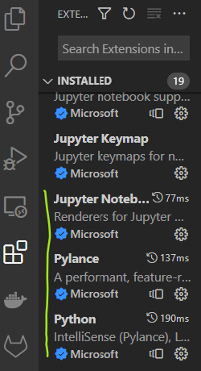
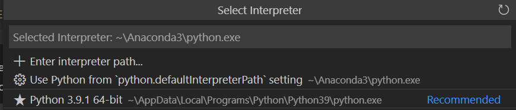
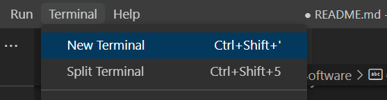
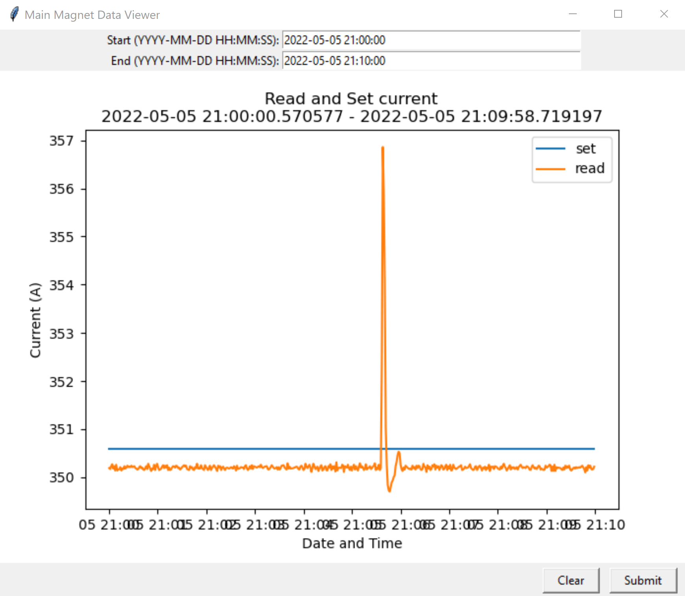

# ISIS Controls Group (Software) Work Experience

## Skills:
**Technical:**
* Data processing with Python (pandas, numpy)
* Data visualization (matplotlib)
* Front end / GUI programming (tkinter)

**Soft Skills:**
* Requirements gathering
* Prioritization
* ‘Agile’ working
* Responding to change
* Communication 

# Software
**NOTE** if at any point we've installed something but we can't see it in a different software, try closing the software and opening it again. 
## Git
Despite the funny name, git is a version control software that allows us to keep track of changes we've made to our code. It also allows us to work collaboratively with other developers on code as well as keep track of 'issues' or tasks that need doing for our project.

We need to create an account with [Github.com](github.com) and then install the associated software by following the [instructions](https://git-scm.com/download/win) on the git website. 

## Python
These instructions are provided for students that have not installed Python onto their machines previously. 

If you have a Windows laptop/PC, install python from the Microsoft store.

Otherwise, install python from the [python website](https://www.python.org/downloads/) and when running the installation Wizard, make sure to add Python to the Path (see image)


## Visual Studio Code
As our text editor, we will be working with Visual Studio Code. This is a text editor that is useful for writing and executing python code as it gives you hints and tips for how to follow the python style guide (PEP8). I'll say that this isn't the only one available but it's the one we use in our group and I've found it relatively easy to use!

Clicking on this [link](https://code.visualstudio.com/docs?dv=win) should automatically start a windows download. Once the download is complete, run the .exe file, finish the installation and open the editor. 

Within the editor, install the **python, jupyter and pylance** extensions. You can do this by clicking on the icon with four squares on the left hand side of the screen (once you've opened VSC) and searching those names. The extensions should each have a blue tick and the word Microsoft next to it.



Once these have installed, we need to configure VSC to use the version of Python that we have installed. To do this, press `ctrl + shift + p` and search `Python: select interpreter`. Click on this and select the version of Python that you have installed. 




Verify that this has worked by opening a new terminal in VSC and running 



```
python --version
```

This should display the version of python that you have installed. 

To access the folder that contains the files we're working with, open this folder in VSC from `file > open folder` and navigate to your folder on your laptop.

Now, we want to access the relevant files for the project, which can be found in our Git repository. We can get local copies of these files by 'cloning' the repository. We do this by running ```git clone https://github.com/kathryn-baker/work-experience.git``` in the terminal. This should make a new folder in our directory called work-experience. You can move into that folder in the terminal by running `cd work-experience` in the terminal.  

# Data Viewer
The goal of this project is to develop a data viewer that will allow our equipment owners to look at the machine parameters that interest them. For now they just want to look at the set and read currents of the main magnet power supplies between particular time ranges so they can see if the read value is close enough to the desired set value. Being able to visualise the data helps them run 'post mortem' analyses when things on the machine go wrong.

In order to do this, we will need to process the historic data to make sure it's clean and relevant and then display it in a Graphical User Interface (GUI). This will all be coded in Python as we need to be able to access the data viewer without internet. 

## Application
Here I've included an image of what we want the final data viewer to look like:



It should include:
* a place for the user to input their desired time range
* a submit button to allow the user to send their query
* a plot of the read and set values in that time
* a clear button to allow them to start over


## Useful Tutorials
* Pandas - https://www.youtube.com/playlist?list=PL-osiE80TeTsWmV9i9c58mdDCSskIFdDS
* matplotlib - https://www.youtube.com/watch?v=D8rwqYcVvmM
* tkinter - https://realpython.com/python-gui-tkinter/

